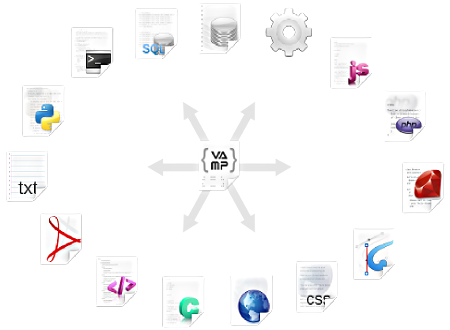

# VAMP
#### V e r s a t i l e &nbsp;&nbsp; A p p l i c a t i o n &nbsp;&nbsp; M e t a - P r o g r a m m i n g
-----------------------------------------------------------------------------------------------

## Introduction

As its acronym suggests, VAMP is indeed versatile. 
Here's a few things you should know:
- it has an interpreter (daemon), a compiler, and an extensible transpiler
- it can transpile any mime-type it has a mime-library extension for
- it is securely scalable across several servers -or domains, for n-tier software architecture
- it can be used for both server-side & client side and its syntax is clean & easy to learn
- it can create, read & listen on any permissible resource, path, socket, & child-process
- it can be used as an active database, or used for programming, configuration and content authoring
- it has a configurable "view" mechanism, both for CLI & GUI - which have similar instructions
- it is built to be stable, so it will not crash (under normal conditions)
- it runs in its own directory which is your runtime "project root"
- its directory and file structure is part of the live runtime structure where folders are "nodes" (objects)
- structures (like "nodes") can be defined inside VAMP files, not only folders
- its structure is loaded at "boot time" and lives in memory; more on this in a bit, keep reading
- the live structure entities (and attributes) are referenced as "pointers", so it runs fast
- anything in the runtime has "meta-attributes", called "aspects" some of which are "intrinsic"
- the intrinsic concepts & aspects are designed for rapid prototyping and development
- the mathematical expressions are designed to be "safe", so it handles things like "devision by zero" well
- the mathematical expressions handle any data-type, -not only numbers

The power of VAMP lies in its simplicity, structure, extensibility, portability and runtime stability; alas -it is up to the systems engineer to lay out the proper architecture. 

However bold these claims seem, there is much more to elaborate on the points above, and even more, 
so keep reading...  It won't hurt &nbsp; :)
   

### Installation
VAMP can be installed from its repository here: https://github.com/xacra/vamp 
Navigate to the `dist/bin` folder, in which you will find a list of folders named according to the supported operating systems.

   

  

#### Linux

- Navigate to where it downloaded and make sure it is executable
- Open a term

### Extensibility

The mime-type library in VAMP comes default with transpilers for:
- HTML
- CSS
- JavaScript
- PlainText

If the mime-type is not available on the VAMP repository, then you can simply make your own. 
The punch-line here is that you can code in one language and have your instructions translated (or compiled) to any other mime-type, depending on what you're authoring and what the target platform is of coarse.

   

above :: illustration of possible mime-type compilations
  

You can also compile your VAMP project into a stand-alone exectutable; which could be anything, from a systems API or service, a plug-in or module for another service -to native desktop GUI applications. 
Depending on your development setup, the VAMP compiler can compile executable that runs natively on Linux, OSX & Windows. 

   
   
=

   
   
   

above :: illustration of native binary compatible platforms
  

VAMP's built-in "view" mechanism saves a lot of time.

   

### Structure

   

-----------------------------------------------------------------------------------------------
 
