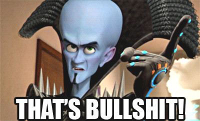
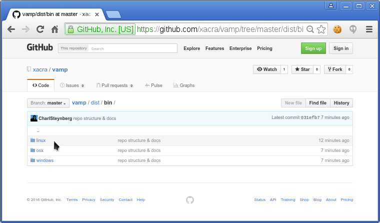
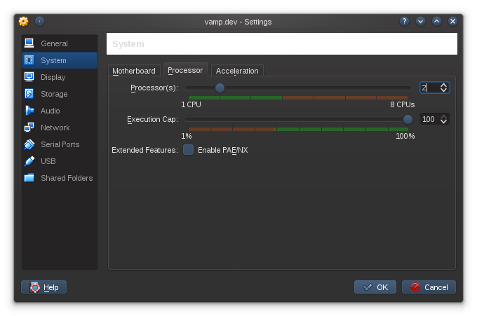
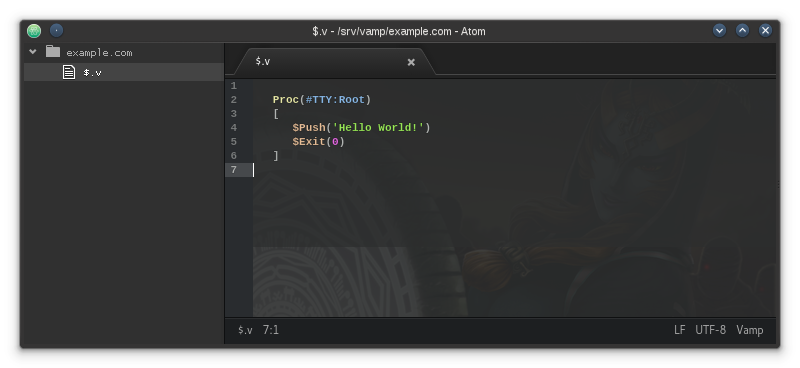

 

# VAMP - Orientation
#### V e r s a t i l e &nbsp;&nbsp; A p p l i c a t i o n &nbsp;&nbsp; M e t a - P r o g r a m m i n g
-----------------------------------------------------------------------------------------------
 

## Introduction

As its acronym suggests, VAMP is indeed versatile. 
This document is to familiarize yourself with the basics, installing VAMP, and make a "Hello World!" app. 
However tedious it may seem reading through some of the text below, take your time, it won't hurt &nbsp; :)

The default VAMP setup may seem larger in file-size than some "normal" programming languages; however, in comparrison with software stacks such as the infamous "LAMP", &nbsp; -VAMP's default "package" size is close in comparison.

What you get with the VAMP package -and what you can do with it, well...

   

  

 

### About VAMP

Here's a few things you should know:

- it has an interpreter, a compiler, and a transpiler -which are all configurable & extensible
- it can transpile any mime-type it has a mime-library extension for
- it is securely scalable across several projects, servers -or domains, for n-tier software architecture
- it can be used for both server-side & client side and its syntax is clean & easy to learn
- it can create, read & listen on any permissible resource, path, socket, & child-process
- it can be used as an active database, or used for programming, configuration and content authoring
- it has a configurable "view" mechanism, both for CLI & GUI - which have similar instructions
- it is built to be stable, so it will not crash (under normal conditions)
- it runs in its own directory which is your runtime "project root" & every project has its own daemon
- its directory and file structure is part of the live runtime structure where folders are "nodes" (objects)
- structures (like "nodes") can be defined inside VAMP files, not only folders
- its structure is loaded at "boot time" and lives in memory; more on this in a bit, keep reading
- the live structure entities (and attributes) are referenced as "pointers", so it runs fast
- anything in the runtime has "meta-attributes", called "aspects" some of which are "intrinsic"
- the intrinsic concepts & aspects are designed for rapid prototyping and development
- the mathematical expressions are designed to be "safe", so it handles things like "devision by zero" well
- the aritmetic operators handle any data-type, -not only numbers
 

The power of VAMP is in its structure, expressive language, simplicity, useful concepts, extensibility, portability, and runtime stability; alas -it is up to the systems engineer to lay out the proper architecture. 
VAMP is not a "framework". It sticks with the structure you define, so it is only as complex as your own structure. The structure you define is your folders & files, together with their relationships with one-another.

.. but hang on a second.. - no frameworks? 
YES! - Why let your creative thinking be handicapped by limited ideologies?

   

 

You create your structure; VAMP lets you stick to it; -unless you explicitly need your structure mutable during runtime; which is also supported. 
Of coarse you can make a "framework" -or "boiler-plate" with VAMP, all this means is that with VAMP you don't really need a bulky framework to get things done as it has a lot of useful tools and methods built into the language and its libraries, which are extensible.
The point here is: "freedom with rules", and you are the author of these "rules" - or rather: "structure".
 

 

### Extensibility

VAMP's default mime-type library comes with transpilers for:
- HTML
- CSS
- JavaScript
- PlainText

The mime library can be extented either by installing it from the repository, or building your own. 
The punch-line here is that you can code in one language and have your instructions translated (or compiled) to any other mime-type, depending on what you're authoring and what the target platform is of coarse.

So what's the big deal? 
Well, as we all know, some languages are great for some things and others are better at other things, depending on what you need to do, or on which platform it should be done on; however, these languages have different syntax, and some languages have the power with which you can blow your foot off, or do something really interesting - if done right.

Now, using the "best practices" & the right tools for whatever language you're authoring may become tricky and most of the time -developers make "boiler-plates" in which ever language they use so they can have handy tools at their disposal during new project development, or maintenance work.

Wouldn't it be great if we could have a language that bring these tools together, for which ever language, and you use one language to program a dozen other languages - at once? A language that does not get in your way, but is expressive and extensible, so you do not need to repeat yourself all the time.

   

 

 

You can also compile your VAMP project into a stand-alone exectutable; which could be anything, from a systems API or service, a plug-in or module for another service -to native desktop GUI applications. 
Depending on your development setup, the VAMP compiler can compile executable that runs natively on Linux, OSX & Windows. 

   
   
=

   
   
   

above :: illustration of VAMP's native binary compatible platforms

So based on the fact that we can extend any VAMP feature, and also create & edit its mime-libraries; it means that you can make a "boiler-plate" once, tell VAMP how to use it and which words relate to what and use it anywhere in your future VAMP projects.

By "anywhere" I really mean it: server back-end, data-base, web interface, native desktop GUI apps; -even interactive 3D web applications -or installable 3D games; videos with syncronized audio & sub-titles; still images with super-imposed overlays, etc, etc..

It is important to know that this is in deed possible, but VAMP does not come with these compilers & transpilers by default, so, if it exists in the VAMP repo, by all means, help yourself, otherwize, buy it, -or get someone to develop it, or build it yourself - then sell it - or donate it to the VAMP repository for free, if you want :)

However you decide how to use VAMP is up to you. The point is that it's an incredibly powerful system, that is easy to learn, simple to use, easy to extend, and applicable anywhere.
  

### Structure

VAMP is all about structure. From your project's folders & files to the code in those files - it is all used as a whole. 
Its content operators shows very close correlation between folder-tree and VAMP code. Here's an example:

   

above :: illustration of folder-tree structure in correlation with VAMP code
 

 

### View - GUI & CLI

VAMP comes default with configurable & programmable "view" mechanisms that use the same methods to "show" things to the user. This is directly related to VAMP's "Bios" (basic input-output system).

The GUI part is available for both web browsers and native desktop applications, depending if you compile your project to native binary -or run it as a server/service on the internet. 

   

above :: VAMP's default GUI web browser compatiblity list
  

The CLI part is for system administrators and hardcore devls (developers). It can be used to create -or manage projects on the fly. The VAMP runtime supports "hot-loading", so you do not need to restart your project daemon when minor changes are made to the structure; remember, it works like a data-base; you don't need to restart a database if you insert or delete information, that would be quite pointless :)

When working with the CLI you have a lot of power though. You can "save" the new structures you create in code -to disk, -where you also have the option to save it as a "vamp file" or tree structure. This is covered later.
 

   
   

  

The VAMP Bios (basic input - output system) adapts its input and output according to the transmission used; however, the developer does not need to apply a different way of sending messages, or reading input to and from any of these. This can be configured -per Bios; you have the freedom to customize pretty much anything. 

This needs elaboration, but I hope this introduction shared enough info to inspire your into reading the rest -and start using VAMP!

-----------------------------------------------------------------------------------------------

 

 

## Installation
VAMP can be installed from its repository here: https://github.com/xacra/vamp 
Navigate to the `dist/bin` folder, in which you will find a list of folders named according to the supported operating systems.

   

above :: the VAMP repository on GitHub
 

#### Linux

- Download the `vampSetup.sh` file from the `linux` folder.
- From the terminal, navigate to where it downloaded and make sure it is executable.
- Type: `./vampSetup.sh` and follow the prompts.
- To test if VAMP was sucessfully installed, type: `vamp -v` and you should see something like: `0.1.0`

 

#### OSX & Windows

- Coming soon!

-----------------------------------------------------------------------------------------------
 

 

## Development Environment

VAMP does not require a specific development environment at all. You can simply install VAMP on which ever host-machine you want and use a plain text editor for coding, and a terminal to run or compile your projects; however if you're serious about your work you should at least run your test server on a separate host (or virtual machine) - and use some a proper text editor for programming.

Throughout this documentation, the file extension: `.v` is used for "vamp" files. Your local machine's operating system may already have the ".v" file extension associated with some other application; however, you do not need to use the `.v` file extension exclusively; - see the "Hello World" section below for more info on which alternative file extensions to use.

File extensions in VAMP are important. Not only is it easy to spot for a human, but also, the VAMP interpreter can recognize combination file extensions, like: `style.css.v` and process it "explicitly"; -where if the `.css.` part is missing, then it is processed "implicitly" - which could be slower. 
If you have the VAMP SDK package installed, the icons in your local file browser will show recognizable icons for VAMP files, and combinations also.

   

  

 

### Virtual machine
There are many VM solutions out there, the solution I recommend is using `VirtualBox` with `Arch Linux` running on a machine you configured; but you can use anything you like.

To take advantage of "compiling" it is recommended that you assign at least 2 virtual CPU's to your VM -with at least 2Gb of RAM. The machine does not need a GUI, so you can just use a minimal installation and set it up the way you want. You can also launch your VBox "headless" (without a "window") from the terminal and have it run in the background.

You can also "mount" a folder (path) which is on your virtual machine into a folder of your local machine. This is very useful for quick navigation, screen-shots, etc - using your local machine's file-manager to manage files & folders on your Vbox.

Consult the internet for more info on this as there are plenty tutorials on how to do these things - which is not in the scope of this document, but I thought it's worth mentioning to have something that "just works" without much hassle. It is very useful; not only for VAMP, but for your other projects as well.

   

above :: VirtualBox
  

 

### Syntax highlighting
It is important that your text editor supports syntax highlighting of some kind as it makes it easier to identify what your're typing.

If your text editor does not support VAMP syntax by default, there may be a syntax highlighting package for your editor  in the VAMP repository. 
Have a look here: https://github.com/xacra/vamp/tree/master/devl/ext/editor

At the time of this writing there is a syntax highlighting package available for `Atom`, so you can just install it.

   

above :: VAMP syntax highlighting in Atom

-----------------------------------------------------------------------------------------------
 

 

## Hello World
This excercize is actually very quick, but for the sake of getting a firm grasp of VAMP, we'll take it step by step. 
Note that you do not need to do the "mounting" thing, and you also do not need the VAMP SDK;  these are just to make things more "user friendly" for yourself while you develop VAMP projects.
  

Before you dive in, read the following first - so you know exactly what to expect:

1. Any VAMP project needs its own folder (which defines the runtime scope)
2. VAMP files can have any of the following file extensions: `.v` `.va` `.vam` `.vamp`
3. `$` (meta) files are optional, but mandatory in `project root` and refer to the folder they are in
4. `$` files are the only files that get loaded automatically, and this happens in alphabetical order
5. the contents of VAMP files are statements in the context of the file-name and folder hierarchy
6. statements are evaluated by context, parsed from left-to-right and top-to-bottom
7. the return value of any context is determined implicitly or explicitly
  

For clarity & brevity, I'll assume the following:
- you have installed VAMP on your development server and have installed the VAMP SDK on your local machine;
- you're using a `Linux` machine as project server (where VAMP is installed);
- you have mounted the folder path of this server in which your VAMP projects will reside --into your local file-system;
- you either have a terminal window open that is connected to this dev server via SSH, or you're using a rich IDE with SSH support -OR -simply just the open VBOX window that runs your dev server.
- your text editor (or IDE) supports navigating file systems.
  

With all the above in in mind, it's time to kick some booty!

   

 

 

**Let's get started:**
- Within the target file-system, navigate to your main projects (plural) container (folder).
- Create a new folder in there, so the path to it will be something like: `/srv/vamp/example.com` 
- Inside this `example.com` folder, create a text file named: `$.v` (take note of the file extension)

Your `project root` structure of "example.com" should look something like this:

   

above :: project root of "example.com"
  

Using your editor, open the `$.v` file and inside it, type the code you see in the image below, and **save**. 

   

above :: project: "example.com"
  

 

**Testing**

To run your project, use your connected SSH interface (terminal) -or VBox window, and inside it type something like: 
`vamp init /srv/vamp/example.com` and hit "enter" (or return) on your keyboard.

If all went well, you should see something like this:

   

above :: project: "example.com" output
 

If your results are not as above, then consult the "troubleShoot" doc, but if all is good, then: 
Congrads!
  

   

 

-----------------------------------------------------------------------------------------------
 
